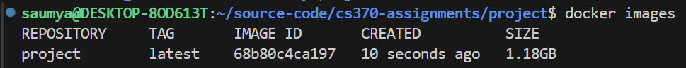

# Segment Anything Model Finetuning for Remote Sensing Applications
## Milestone 1 - 3/24/24
### SAM Background Research
In order to complete this, I went through both [the SAM implementation](https://segment-anything.com/) and [the SAM paper](https://arxiv.org/abs/2101.04703) to gain a better understanding of the Segment Anything Model and how it works. From my understanding, we use an image encoder to encode an image into an embedding. Then, we provide a prompt in the form of points, a box, or masks. These are fed into a prompt encoder. Then, the image embedding and the prompt encoder output are fed into the mask decoder, giving us the final mask. This image was particularly helpful for understanding the model:
<br><br>
I also supplemented my research with [this YouTube video](https://www.youtube.com/watch?v=D-D6ZmadzPE&ab_channel=Roboflow).

### Geographical Information Systems (GIS)
In order to complete this, I first downloaded GQIS to my desktop with the following [link](https://qgis.org/en/site/). Here is evidence of the download:
<br><br>
After that, I read through [this documentation](https://docs.qgis.org/3.34/en/docs/gentle_gis_introduction/index.html) to introduce myself to GIS, following along with my installed version of the application when needed.

### Development Environment
As of right now, I am leaning towards using Google Colab as my development environment since I am having trouble getting Docker to detect my NVIDIA GPU. However, I did set up a containerized development environment that I've documented below:

To set up my docker environment and understand how it works, I followed [this tutorial](https://www.youtube.com/watch?v=kuBQ8ylVXBU&ab_channel=AladdinPersson). I already had Docker Engine and Docker Desktop installed from previous projects and configured to work through WSL2:
<br><br>
<br><br>
Then, I created a basic Dockerfile and requirements.txt to set up my development environment. My criteria for success was just to ensure that I could build the Docker image using the Dockerfile, run the container, and forward Jupyter notebook traffic to the container's port as defined in the Dockerfile. To do this, after creating the Dockerfile and requirements.txt, I built the container and ran it. This was done by running ```docker build -t project .``` followed by ```docker run -p 8888:8888 project``` in my project directory. Then, I accessed the container's notebook via the exposed port. This was done by navigating to http://localhost:8888 and running the notebook. Here are screenshots from the aforementioned steps:
<br><br>
<br><br>
<br><br>